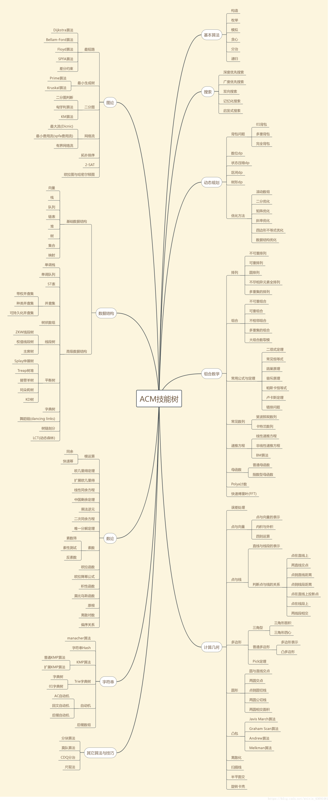

> 你不努力肯定会有努力的人，你真的愿意一辈子这样了吗？



# 1.排序

## 1.选择排序

1. 用俩个指针，一个从0开始，一个往后遍历，如果有比第一个小的就记录，遍历所有数据就交换小的数据到第一个指针位置，没有就直接不变，然后就是重复遍历之道第一个指针（下标）到最后一个数据。
2. 代码
```c++
template<typename T> //整數或浮點數皆可使用，若要使用物件（class）時必須設定大於（>）的運算子功能
      void selection_sort(std::vector<T>& arr) {
              for (int i = 0; i < arr.size() - 1; i++) {
                      int min = i;
                      for (int j = i + 1; j < arr.size(); j++)
                              if (arr[j] < arr[min])
                                      min = j;
                      std::swap(arr[i], arr[min]);
              }
      }
```
3. 演示图


## 2.冒泡排序

1. 这个就是遇到比第一个小的就交换数据，或者位置，直到最小的都交换到第一个位置。重复遍历。
2. 代码
```c++
	  #include <iostream>
      using namespace std;
      template<typename T> //整数或浮点数皆可使用,若要使用类(class)或结构体(struct)时必须重载大于(>)运算符
      void bubble_sort(T arr[], int len) {
              int i, j;
              for (i = 0; i < len - 1; i++)
                      for (j = 0; j < len - 1 - i; j++)
                              if (arr[j] > arr[j + 1])
                                      swap(arr[j], arr[j + 1]);
      }
      int main() {
              int arr[] = { 61, 17, 29, 22, 34, 60, 72, 21, 50, 1, 62 };
              int len = (int) sizeof(arr) / sizeof(*arr);
              bubble_sort(arr, len);
              for (int i = 0; i < len; i++)
                      cout << arr[i] << ' ';
              cout << endl;
              float arrf[] = { 17.5, 19.1, 0.6, 1.9, 10.5, 12.4, 3.8, 19.7, 1.5, 25.4, 28.6, 4.4, 23.8, 5.4 };
              len = (float) sizeof(arrf) / sizeof(*arrf);
              bubble_sort(arrf, len);
              for (int i = 0; i < len; i++)
                      cout << arrf[i] << ' '<<endl;
              return 0;
      }
```
3. 演示图


## 3. 插入排序

1. 将第一待排序序列第一个元素看做一个有序序列，把第二个元素到最后一个元素当成是未排序序列。从头到尾依次扫描未排序序列，将扫描到的每个元素插入有序序列的适当位置。（如果待插入的元素与有序序列中的某个元素相等，则将待插入元素插入到相等元素的后面）
2. 代码
```c++
 void insertion_sort(int arr[],int len){
              for(int i=1;i<len;i++){
                      int key=arr[i];
                      int j=i-1;
                      while((j>=0) && (key<arr[j])){
                              arr[j+1]=arr[j];
                              j--;
                      }
                      arr[j+1]=key;
              }
      }
```
3. 演示图


## 4.快速排序

 1. 步骤
	 1. 从数列中挑出一个元素，称为 "基准"（pivot）;
      2. 重新排序数列，所有元素比基准值小的摆放在基准前面，所有元素比基准值大的摆在基准的后面（相同的数可以到任一边）。在这个分区退出之后，该基准就处于数列的中间位置。这个称为分区（partition）操作；
      3. 递归地（recursive）把小于基准值元素的子数列和大于基准值元素的子数列排序；
  2. 代码
```C++
sort(a,a + n);// 排序a[0]-a[n-1]的所有数.
```
[参考](http://www.dutor.net/index.php/2011/04/recursive-iterative-quick-sort/)
```c++
// 参考：http://www.dutor.net/index.php/2011/04/recursive-iterative-quick-sort/
      //迭代法
      struct Range {
          int start, end;
          Range(int s = 0, int e = 0) {
              start = s, end = e;
          }
      };
      template <typename T> // 整數或浮點數皆可使用,若要使用物件(class)時必須設定"小於"(<)、"大於"(>)、"不小於"(>=)的運算子功能
      void quick_sort(T arr[], const int len) {
          if (len <= 0)
              return; // 避免len等於負值時宣告堆疊陣列當機
          // r[]模擬堆疊,p為數量,r[p++]為push,r[--p]為pop且取得元素
          Range r[len];
          int p = 0;
          r[p++] = Range(0, len - 1);
          while (p) {
              Range range = r[--p];
              if (range.start >= range.end)
                  continue;
              T mid = arr[range.end];
              int left = range.start, right = range.end - 1;
              while (left < right) {
                  while (arr[left] < mid && left < right) left++;
                  while (arr[right] >= mid && left < right) right--;
                  std::swap(arr[left], arr[right]);
              }
              if (arr[left] >= arr[range.end])
                  std::swap(arr[left], arr[range.end]);
              else
                  left++;
              r[p++] = Range(range.start, left - 1);
              r[p++] = Range(left + 1, range.end);
          }
      }
```
```c++
//递归法
      template <typename T>
      void quick_sort_recursive(T arr[], int start, int end) {
          if (start >= end)
              return;
          T mid = arr[end];
          int left = start, right = end - 1;
          while (left < right) { //在整个范围内搜寻比枢纽元值小或大的元素，然后将左侧元素与右侧元素交换
              while (arr[left] < mid && left < right) //试图在左侧找到一个比枢纽元更大的元素
                  left++;
              while (arr[right] >= mid && left < right) //试图在右侧找到一个比枢纽元更小的元素
                  right--;
              std::swap(arr[left], arr[right]); //交换元素
          }
          if (arr[left] >= arr[end])
              std::swap(arr[left], arr[end]);
          else
              left++;
          quick_sort_recursive(arr, start, left - 1);
          quick_sort_recursive(arr, left + 1, end);
      }
      template <typename T> //整數或浮點數皆可使用,若要使用物件(class)時必須設定"小於"(<)、"大於"(>)、"不小於"(>=)的運算子功能
      void quick_sort(T arr[], int len) {
          quick_sort_recursive(arr, 0, len - 1);
      }
```
3. 演示图


## 5. 堆排序

1. 堆排序（Heapsort）是指利用堆这种数据结构所设计的一种排序算法。堆积是一个近似完全二叉树的结构，并同时满足堆积的性质：即子结点的键值或索引总是小于（或者大于）它的父节点。堆排序可以说是一种利用堆的概念来排序的选择排序。分为两种方法：
      1. 大顶堆：每个节点的值都大于或等于其子节点的值，在堆排序算法中用于升序排列；
      2. 小顶堆：每个节点的值都小于或等于其子节点的值，在堆排序算法中用于降序排列；
      堆排序的平均时间复杂度为 Ο(nlogn)。
2. 算法步骤
      1. 创建一个堆 H[0……n-1]；
      2. 把堆首（最大值）和堆尾互换；
      3. 把堆的尺寸缩小 1，并调用 shift_down(0)，目的是把新的数组顶端数据调整到相应位置；
      4. 重复步骤 2，直到堆的尺寸为 1。

   3. 代码
```c++
 #include <iostream>
      #include <algorithm>
      using namespace std;
      
      void max_heapify(int arr[], int start, int end) {
          // 建立父節點指標和子節點指標
          int dad = start;
          int son = dad * 2 + 1;
          while (son <= end) { // 若子節點指標在範圍內才做比較
              if (son + 1 <= end && arr[son] < arr[son + 1]) // 先比較兩個子節點大小，選擇最大的
                  son++;
              if (arr[dad] > arr[son]) // 如果父節點大於子節點代表調整完畢，直接跳出函數
                  return;
              else { // 否則交換父子內容再繼續子節點和孫節點比較
                  swap(arr[dad], arr[son]);
                  dad = son;
                  son = dad * 2 + 1;
              }
          }
      }
      
      void heap_sort(int arr[], int len) {
          // 初始化，i從最後一個父節點開始調整
          for (int i = len / 2 - 1; i >= 0; i--)
              max_heapify(arr, i, len - 1);
          // 先將第一個元素和已经排好的元素前一位做交換，再從新調整(刚调整的元素之前的元素)，直到排序完畢
          for (int i = len - 1; i > 0; i--) {
              swap(arr[0], arr[i]);
              max_heapify(arr, 0, i - 1);
          }
      }
      
      int main() {
          int arr[] = { 3, 5, 3, 0, 8, 6, 1, 5, 8, 6, 2, 4, 9, 4, 7, 0, 1, 8, 9, 7, 3, 1, 2, 5, 9, 7, 4, 0, 2, 6 };
          int len = (int) sizeof(arr) / sizeof(*arr);
          heap_sort(arr, len);
          for (int i = 0; i < len; i++)
              cout << arr[i] << ' ';
          cout << endl;
          return 0;
      }
```
4. 演示图


## 6.希尔排序

1. 希尔排序，也称递减增量排序算法，是插入排序的一种更高效的改进版本。但希尔排序是非稳定排序算法。
      希尔排序是基于插入排序的以下两点性质而提出改进方法的：
      - 插入排序在对几乎已经排好序的数据操作时，效率高，即可以达到线性排序的效率；
      - 但插入排序一般来说是低效的，因为插入排序每次只能将数据移动一位；
      希尔排序的基本思想是：先将整个待排序的记录序列分割成为若干子序列分别进行直接插入排序，待整个序列中的记录"基本有序"时，再对全体记录进行依次直接插入排序。
   2. 步骤
      + 选择一个增量序列 t1，t2，……，tk，其中 ti > tj, tk = 1；
      + 按增量序列个数 k，对序列进行 k 趟排序；
      + 每趟排序，根据对应的增量 ti，将待排序列分割成若干长度为 m 的子序列，分别对各子表进行直接插入排序。仅增量因子为 1 时，整个序列作为一个表来处理，表长度即为整个序列的长度。
   3. 代码
```c++
template<typename T>
      void shell_sort(T array[], int length) {
          int h = 1;
          while (h < length / 3) {
              h = 3 * h + 1;
          }
          while (h >= 1) {
              for (int i = h; i < length; i++) {
                  for (int j = i; j >= h && array[j] < array[j - h]; j -= h) {
                      std::swap(array[j], array[j - h]);
                  }
              }
              h = h / 3;
          }
      }
```
4. 演示图


## 7.归并排序

1. 归并排序（Merge sort）是建立在归并操作上的一种有效的排序算法。该算法是采用分治法（Divide and Conquer）的一个非常典型的应用。
      作为一种典型的分而治之思想的算法应用，归并排序的实现由两种方法：
      - 自上而下的递归（所有递归的方法都可以用迭代重写，所以就有了第 2 种方法）；
      - 自下而上的迭代；
>	在《数据结构与算法 JavaScript 描述》中，作者给出了自下而上的迭代方法。但是对于递归法，作者却认为：
 > 	However, it is not possible to do so in JavaScript, as the recursion goes too deep for the language to handle.
	然而，在 JavaScript 中这种方式不太可行，因为这个算法的递归深度对它来讲太深了。
      说实话，我不太理解这句话。意思是 JavaScript 编译器内存太小，递归太深容易造成内存溢出吗？还望有大神能够指教。
      和选择排序一样，归并排序的性能不受输入数据的影响，但表现比选择排序好的多，因为始终都是 O(nlogn) 的时间复杂度。代价是需要额外的内存空间。

   2.  算法步骤
	  1. 申请空间，使其大小为两个已经排序序列之和，该空间用来存放合并后的序列；
	  2. 设定两个指针，最初位置分别为两个已经排序序列的起始位置；
	  3. 比较两个指针所指向的元素，选择相对小的元素放入到合并空间，并移动指针到下一位置；
	  4. 重复步骤 3 直到某一指针达到序列尾；
	  5. 将另一序列剩下的所有元素直接复制到合并序列尾。
   3. 代码
```c++
//迭代版：
      template<typename T> // 整數或浮點數皆可使用,若要使用物件(class)時必須設定"小於"(<)的運算子功能
      void merge_sort(T arr[], int len) {
          T *a = arr;
          T *b = new T[len];
          for (int seg = 1; seg < len; seg += seg) {
              for (int start = 0; start < len; start += seg + seg) {
                  int low = start, mid = min(start + seg, len), high = min(start + seg + seg, len);
                  int k = low;
                  int start1 = low, end1 = mid;
                  int start2 = mid, end2 = high;
                  while (start1 < end1 && start2 < end2)
                      b[k++] = a[start1] < a[start2] ? a[start1++] : a[start2++];
                  while (start1 < end1)
                      b[k++] = a[start1++];
                  while (start2 < end2)
                      b[k++] = a[start2++];
              }
              T *temp = a;
              a = b;
              b = temp;
          }
          if (a != arr) {
              for (int i = 0; i < len; i++)
                  b[i] = a[i];
              b = a;
          }
          delete[] b;
      }
```
```c++
 //递归版：
      void Merge(vector<int> &Array, int front, int mid, int end) {
          // preconditions:
          // Array[front...mid] is sorted
          // Array[mid+1 ... end] is sorted
          // Copy Array[front ... mid] to LeftSubArray
          // Copy Array[mid+1 ... end] to RightSubArray
          vector<int> LeftSubArray(Array.begin() + front, Array.begin() + mid + 1);
          vector<int> RightSubArray(Array.begin() + mid + 1, Array.begin() + end + 1);
          int idxLeft = 0, idxRight = 0;
          LeftSubArray.insert(LeftSubArray.end(), numeric_limits<int>::max());
          RightSubArray.insert(RightSubArray.end(), numeric_limits<int>::max());
          // Pick min of LeftSubArray[idxLeft] and RightSubArray[idxRight], and put into Array[i]
          for (int i = front; i <= end; i++) {
              if (LeftSubArray[idxLeft] < RightSubArray[idxRight]) {
                  Array[i] = LeftSubArray[idxLeft];
                  idxLeft++;
              } else {
                  Array[i] = RightSubArray[idxRight];
                  idxRight++;
              }
          }
      }
      
      void MergeSort(vector<int> &Array, int front, int end) {
          if (front >= end)
              return;
          int mid = (front + end) / 2;
          MergeSort(Array, front, mid);
          MergeSort(Array, mid + 1, end);
          Merge(Array, front, mid, end);
      }
```
4. 演示图


## 8.计数排序

1. 计数排序的核心在于将输入的数据值转化为键存储在额外开辟的数组空间中。作为一种线性时间复杂度的排序，计数排序要求输入的数据必须是有确定范围的整数。
2. 计数排序的特征
	+ 当输入的元素是 n 个 0 到 k 之间的整数时，它的运行时间是 Θ(n + k)。计数排序不是比较排序，排序的速度快于任何比较排序算法。
	+ 由于用来计数的数组C的长度取决于待排序数组中数据的范围（等于待排序数组的最大值与最小值的差加上1），这使得计数排序对于数据范围很大的数组，需要大量时间和内存。例如：计数排序是用来排序0到100之间的数字的最好的算法，但是它不适合按字母顺序排序人名。但是，计数排序可以用在基数排序中的算法来排序数据范围很大的数组。
	+ 通俗地理解，例如有 10 个年龄不同的人，统计出有 8 个人的年龄比 A 小，那 A 的年龄就排在第 9 位,用这个方法可以得到其他每个人的位置,也就排好了序。当然，年龄有重复时需要特殊处理（保证稳定性），这就是为什么最后要反向填充目标数组，以及将每个数字的统计减去 1 的原因。
	+ 算法的步骤如下：
		  - （1）找出待排序的数组中最大和最小的元素
		  - （2）统计数组中每个值为i的元素出现的次数，存入数组C的第i项
		  - （3）对所有的计数累加（从C中的第一个元素开始，每一项和前一项相加）
		  - （4）反向填充目标数组：将每个元素i放在新数组的第C(i)项，每放一个元素就将C(i)减去1。
3. 代码
```c++
 #include <stdio.h>
      #include <stdlib.h>
      #include <time.h>
      
      void print_arr(int *arr, int n) {
              int i;
              printf("%d", arr[0]);
              for (i = 1; i < n; i++)
                      printf(" %d", arr[i]);
              printf("\n");
      }
      
      void counting_sort(int *ini_arr, int *sorted_arr, int n) {
              int *count_arr = (int *) malloc(sizeof(int) * 100);
              int i, j, k;
              for (k = 0; k < 100; k++)
                      count_arr[k] = 0;
              for (i = 0; i < n; i++)
                      count_arr[ini_arr[i]]++;
              for (k = 1; k < 100; k++)
                      count_arr[k] += count_arr[k - 1];
              for (j = n; j > 0; j--)
                      sorted_arr[--count_arr[ini_arr[j - 1]]] = ini_arr[j - 1];
              free(count_arr);
      }
      
      int main(int argc, char **argv) {
              int n = 10;
              int i;
              int *arr = (int *) malloc(sizeof(int) * n);
              int *sorted_arr = (int *) malloc(sizeof(int) * n);
              srand(time(0));
              for (i = 0; i < n; i++)
                      arr[i] = rand() % 100;
              printf("ini_array: ");
              print_arr(arr, n);
              counting_sort(arr, sorted_arr, n);
              printf("sorted_array: ");
              print_arr(sorted_arr, n);
              free(arr);
              free(sorted_arr);
              return 0;
      }
```
4. 演示图
   

## 9.桶排序

   1. 桶排序是计数排序的升级版。它利用了函数的映射关系，高效与否的关键就在于这个映射函数的确定。为了使桶排序更加高效，我们需要做到这两点：

      1. 在额外空间充足的情况下，尽量增大桶的数量
      2. 使用的映射函数能够将输入的 N 个数据均匀的分配到 K 个桶中

      同时，对于桶中元素的排序，选择何种比较排序算法对于性能的影响至关重要。

   2. 1. 什么时候最快
          当输入的数据可以均匀的分配到每一个桶中。
      2. 什么时候最慢
          当输入的数据被分配到了同一个桶中。
      3. 示意图
          元素分布在桶中：
          
          然后，元素在每个桶中排序：
          
      
   3. 代码
```c++
#include<iterator>
      #include<iostream>
      #include<vector>
      using namespace std;
      const int BUCKET_NUM = 10;
      
      struct ListNode{
              explicit ListNode(int i=0):mData(i),mNext(NULL){}
              ListNode* mNext;
              int mData;
      };
      
      ListNode* insert(ListNode* head,int val){
              ListNode dummyNode;
              ListNode *newNode = new ListNode(val);
              ListNode *pre,*curr;
              dummyNode.mNext = head;
              pre = &dummyNode;
              curr = head;
              while(NULL!=curr && curr->mData<=val){
                      pre = curr;
                      curr = curr->mNext;
              }
              newNode->mNext = curr;
              pre->mNext = newNode;
              return dummyNode.mNext;
      }
      
      
      ListNode* Merge(ListNode *head1,ListNode *head2){
              ListNode dummyNode;
              ListNode *dummy = &dummyNode;
              while(NULL!=head1 && NULL!=head2){
                      if(head1->mData <= head2->mData){
                              dummy->mNext = head1;
                              head1 = head1->mNext;
                      }else{
                              dummy->mNext = head2;
                              head2 = head2->mNext;
                      }
                      dummy = dummy->mNext;
              }
              if(NULL!=head1) dummy->mNext = head1;
              if(NULL!=head2) dummy->mNext = head2;
              
              return dummyNode.mNext;
      }
      
      void BucketSort(int n,int arr[]){
              vector<ListNode*> buckets(BUCKET_NUM,(ListNode*)(0));
              for(int i=0;i<n;++i){
                      int index = arr[i]/BUCKET_NUM;
                      ListNode *head = buckets.at(index);
                      buckets.at(index) = insert(head,arr[i]);
              }
              ListNode *head = buckets.at(0);
              for(int i=1;i<BUCKET_NUM;++i){
                      head = Merge(head,buckets.at(i));
              }
              for(int i=0;i<n;++i){
                      arr[i] = head->mData;
                      head = head->mNext;
              }
      }
```
## 10.基数排序

1. 基数排序是一种非比较型整数排序算法，其原理是将整数按位数切割成不同的数字，然后按每个位数分别比较。由于整数也可以表达字符串（比如名字或日期）和特定格式的浮点数，所以基数排序也不是只能使用于整数。
2. 代码
```c++
	int maxbit(int data[], int n) //辅助函数，求数据的最大位数
       {
           int maxData = data[0];              ///< 最大数
           /// 先求出最大数，再求其位数，这样有原先依次每个数判断其位数，稍微优化点。
           for (int i = 1; i < n; ++i)
           {
               if (maxData < data[i])
                   maxData = data[i];
           }
           int d = 1;
           int p = 10;
           while (maxData >= p)
           {
               //p *= 10; // Maybe overflow
               maxData /= 10;
               ++d;
           }
           return d;
       /*    int d = 1; //保存最大的位数
           int p = 10;
           for(int i = 0; i < n; ++i)
           {
               while(data[i] >= p)
               {
                   p *= 10;
                   ++d;
               }
           }
           return d;*/
       }
       void radixsort(int data[], int n) //基数排序
       {
           int d = maxbit(data, n);
           int *tmp = new int[n];
           int *count = new int[10]; //计数器
           int i, j, k;
           int radix = 1;
           for(i = 1; i <= d; i++) //进行d次排序
           {
               for(j = 0; j < 10; j++)
                   count[j] = 0; //每次分配前清空计数器
               for(j = 0; j < n; j++)
               {
                   k = (data[j] / radix) % 10; //统计每个桶中的记录数
                   count[k]++;
               }
               for(j = 1; j < 10; j++)
                   count[j] = count[j - 1] + count[j]; //将tmp中的位置依次分配给每个桶
               for(j = n - 1; j >= 0; j--) //将所有桶中记录依次收集到tmp中
               {
                   k = (data[j] / radix) % 10;
                   tmp[count[k] - 1] = data[j];
                   count[k]--;
               }
               for(j = 0; j < n; j++) //将临时数组的内容复制到data中
                   data[j] = tmp[j];
               radix = radix * 10;
           }
           delete []tmp;
           delete []count;
       }
```
3. 演示图


# 2. 查找

## 1. 顺序查找

+ **定义**：顺序查找是一种简单的查找算法，从列表的第一个元素开始，逐个检查直到找到目标元素或到达列表末尾。
+ **使用前提条件**：无特定要求，适用于未排序和已排序的列表。
+ **算法步骤**：
	1. 从列表的第一个元素开始。
	2. 比较当前元素与目标值。
	3. 如果找到目标值，返回其索引。
	4. 如果当前元素不是目标值，移动到下一个元素。
	5. 重复步骤2-4，直到找到目标值或到达列表末尾。
+ **C++代码模板**：
```cpp
int sequentialSearch(const std::vector<int>& arr, int target) {
    for (int i = 0; i < arr.size(); ++i) {
        if (arr[i] == target) {
            return i; // 找到目标，返回索引
        }
    }
    return -1; // 未找到目标，返回-1
}
```
+ **题目链接**：
	- [LeetCode 704. Binary Search](https://leetcode.com/problems/binary-search/)（虽然题目是二分查找，但你可以用顺序查找来尝试）
## 2. 二分查找
+ **定义**：二分查找是一种在有序数组中查找特定元素的搜索算法，通过不断将搜索区间减半来提高搜索效率。
+ **使用前提条件**：列表必须是有序的。
+ **算法步骤**：
	1. 初始化两个指针，分别指向数组的开始和结束。
	2. 计算中间索引。
	3. 比较中间元素与目标值。
	4. 如果中间元素是目标值，返回其索引。
	5. 如果中间元素小于目标值，将开始指针移动到中间索引的右边。
	6. 如果中间元素大于目标值，将结束指针移动到中间索引的左边。
	7. 重复步骤2-6，直到找到目标值或开始指针超过结束指针。
+ **C++代码模板**：

```cpp
int binarySearch(const std::vector<int>& arr, int target) {
    int left = 0, right = arr.size() - 1;
    while (left <= right) {
        int mid = left + (right - left) / 2;
        if (arr[mid] == target) {
            return mid;
        } else if (arr[mid] < target) {
            left = mid + 1;
        } else {
            right = mid - 1;
        }
    }
    return -1;
}
```

+ **题目链接**：
	- [LeetCode 704. Binary Search](https://leetcode.com/problems/binary-search/)

## 3. 插值查找

+ **定义**：插值查找是基于二分查找的改进版本，它根据目标值可能的位置来选择中间点。
+ **使用前提条件**：列表必须是有序的，且元素分布均匀。
+ **算法步骤**：
	1. 计算插值位置：`pos = low + [(x - arr[low]) * (high - low) / (arr[high] - arr[low])]`
	2. 比较插值位置的元素与目标值。
	3. 如果相等，返回位置。
	4. 如果目标值大于插值位置的元素，在右侧子数组中递归查找。
	5. 如果目标值小于插值位置的元素，在左侧子数组中递归查找。

+ **C++代码模板**：

```cpp
int interpolationSearch(const std::vector<int>& arr, int target) {
    int low = 0, high = arr.size() - 1;
    while (low <= high && target >= arr[low] && target <= arr[high]) {
        if (low == high) {
            if (arr[low] == target) return low;
            return -1;
        }
        int pos = low + ((target - arr[low]) * (high - low)) / (arr[high] - arr[low]);
        if (arr[pos] == target) {
            return pos;
        }
        if (arr[pos] < target) {
            low = pos + 1;
        } else {
            high = pos - 1;
        }
    }
    return -1;
}
```
## 4. 斐波那契查找
+ **定义**：斐波那契查找是一种改进版的二分查找算法，它利用斐波那契数列的特点来进行分割，以达到更优的查找性能。
+ **使用前提条件**：列表必须是有序的。
+ **算法步骤**：
	1. 找到最接近数组大小的斐波那契数，记为F(k)。
	2. 将数组分为两部分，第一部分包含F(k-1)个元素，第二部分包含剩余的元素。
	3. 比较目标值与数组第F(k-1)个位置的元素。
	4. 如果目标值小于该元素，则在第一部分递归执行斐波那契查找。
	5. 如果目标值大于该元素，则在第二部分递归执行斐波那契查找。
	6. 如果找到目标值，返回其索引；否则，继续查找直到找到或确定不存在。
+ **C代码模板**：

```cpp
#include <stdio.h>

int Fibonacci_Search(int *a, int n, int key) {
    int low, high, mid, k;
    low = 1; // 数组起始位置
    high = n;
    k = 0; // 斐波那契数列下标

    // 找到最接近n的斐波那契数
    while (n > F[k] - 1) {
        k++;
    }

    // 将数组扩展到F[k]-1个长度
    for (int i = n; i < F[k] - 1; i++) {
        a[i] = a[n]; // 用最后一个元素填充
    }

    // 开始查找
    while (low <= high) {
        mid = low + F[k - 1] - 1; // 计算mid位置

        if (key < a[mid]) { // 在数组左边查找
            high = mid - 1;
            k = k - 1;
        } else if (key > a[mid]) { // 在数组右边查找
            low = mid + 1;
            k = k - 2;
        } else {
            if (mid <= n) {
                return mid; // 找到，返回位置
            } else {
                return n; // 找到扩展位置，返回原数组长度
            }
        }
    }
    return -1; // 未找到
}

// 斐波那契数列
int F[50] = {0, 1, 1, 2, 3, 5, 8, 13, 21, 34, 55, 89, 144, ...};
```
+ **题目链接**： 斐波那契查找在实际的在线编程题目中并不常见，但你可以尝试解决一些二分查找的变种问题，如：
	- [LeetCode 33. Search in Rotated Sorted Array](https://leetcode.com/problems/search-in-rotated-sorted-array/)
## 5. 树表查找
+ **定义**：树表查找是一种利用树形结构存储数据的方法，通过树的层次关系快速定位到目标节点。
+ **使用前提条件**：需要构建一个树形结构来存储数据。
+ **算法步骤**：
	1. 构建树形结构，如二叉搜索树（BST）。
	2. 将数据插入树中，保持树的平衡性。
	3. 进行查找时，从根节点开始比较。
	4. 如果目标值小于当前节点的值，则在左子树中继续查找。
	5. 如果目标值大于当前节点的值，则在右子树中继续查找。
	6. 如果找到目标值，则返回该节点的位置；否则，继续向下遍历。
+ **C++代码模板**：

```cpp
// 这里省略了二叉搜索树的实现细节
bool treeSearch(TreeNode* root, int target) {
    if (!root) return false;
    if (root->val == target) return true;
    if (target < root->val) return treeSearch(root->left, target);
    return treeSearch(root->right, target);
}
```
+ **题目链接**：
	- [LeetCode 700. Search in a Binary Search Tree](https://leetcode.com/problems/search-in-a-binary-search-tree/)
## 6. 分块查找
+ **定义**：分块查找是将数据集分成多个块，每个块内部是无序的，但块之间是有序的，通过索引表快速缩小搜索范围。
+ **使用前提条件**：数据集被划分为若干块，每块有一个索引值。
+ **算法步骤**：
	1. 维护一个索引表，记录每个块的起始位置和最大值。
	2. 使用二分查找在索引表中确定可能的块。
	3. 在确定的块内进行顺序查找。
+ **C++代码模板**：

```cpp
// 索引表的结构体
struct IndexEntry {
    int start;   // 块的起始位置
    int end;     // 块的结束位置
    int maxVal;  // 块中的最大值
};

// 分块查找函数
int blockSearch(const vector<IndexEntry>& indexTable, const vector<int>& data, int target) {
    // 在索引表中二分查找
    int left = 0, right = indexTable.size() - 1;
    while (left <= right) {
        int mid = left + (right - left) / 2;
        if (indexTable[mid].maxVal < target) {
            left = mid + 1;
        } else {
            right = mid - 1;
        }
    }
    // 在对应的块中进行顺序查找
    for (int i = indexTable[left].start; i <= indexTable[left].end; ++i) {
        if (data[i] == target) return i;
    }
    return -1; // 未找到
}
```

+ **题目链接**：
	- 由于分块查找在实际面试题中较少直接出现，这里提供一个类似概念的题目：[LeetCode 34. Find First and Last Position of Element in Sorted Array](https://leetcode.com/problems/find-first-and-last-position-of-element-in-sorted-array/)
## 7. 哈希查找
+ **定义**：哈希查找是一种通过哈希表（Hash Table）的数据结构实现的快速查找方法，能够以平均 O(1) 时间复杂度完成增删查改操作。
+ **使用前提条件**：需要一个哈希函数和一个处理冲突的机制。
+ **算法步骤**：
	1. 选择合适的哈希函数，计算键的哈希值。
	2. 根据哈希值映射到哈希表的某个槽位。
	3. 如果发生碰撞（即不同的键映射到了同一个槽位），使用链地址法或其他冲突解决策略进行处理。
	4. 在相应的槽位上进行查找。
+ **C++代码模板**：

```cpp
#include <unordered_map>

using namespace std;

int hashSearch(unordered_map<int, int>& hashMap, int target) {
    auto it = hashMap.find(target);
    if (it != hashMap.end()) {
        return it->second; // 返回值的索引或值
    }
    return -1; // 未找到
}
```
+ **题目链接**：
	- [LeetCode 242. Valid Anagram](https://leetcode.com/problems/valid-anagram/)（可以使用哈希表来解决）
	- [LeetCode 49. Group Anagrams](https://leetcode.com/problems/group-anagrams/)（同样可以使用哈希表来分组）